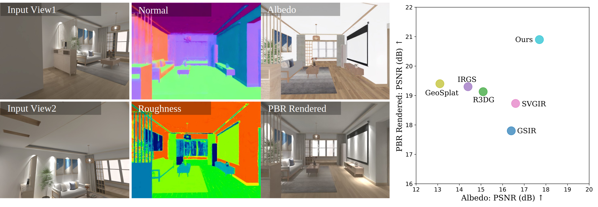
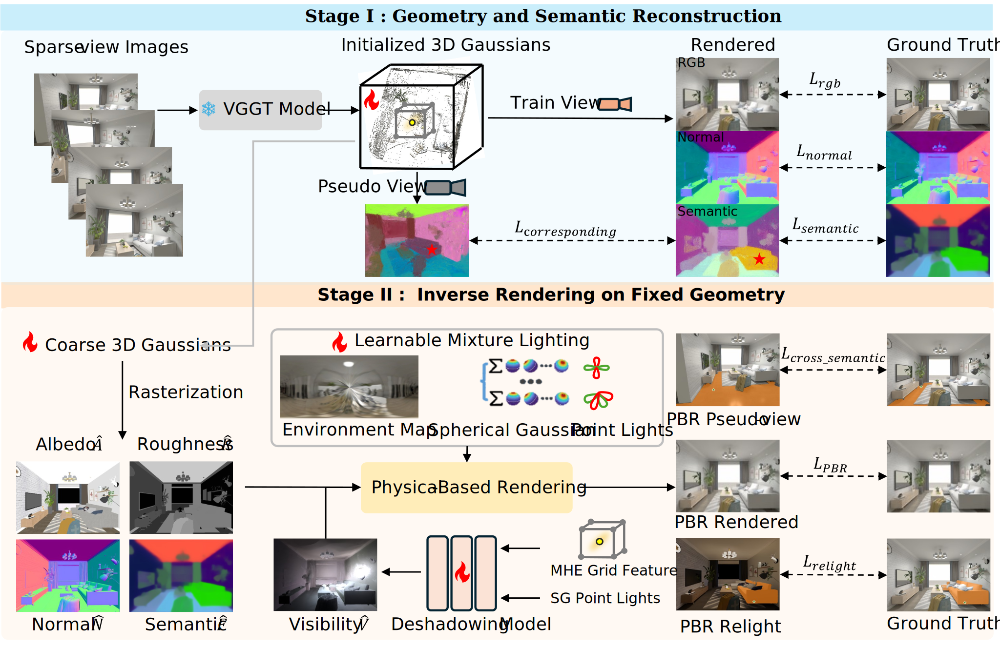

# SGS-Intrinsic: Semantic-Invariant Gaussian Splatting for Sparse-View Indoor Inverse Rendering (CVPR 2026)

Jiahao Niu, Rongjia Zheng, Wenju Xu, Wei-shi Zheng, and Qing Zhang*

<!-- project page and paper -->
<!-- [Project Page](https://dydeblur.github.io/) &nbsp; [Paper](https://arxiv.org/abs/2510.10691)  -->
[Paper](https://arxiv.org/abs/2603.27516)

<!-- pageviews -->
<!-- <a href="https://info.flagcounter.com/dhPB"></a> -->

<!-- teaser -->


Our method achieves high-quality scene-level disentanglement of illumination and material properties from sparse-view input images

## Method Overview


<!-- Our method's overall workflow. Dotted arrows and dashed arrows describe the pipeline for modeling camera motion blur and modeling defocus blur, respectively at training time. Solid arrows show the process of rendering sharp images at the inference time. Please refer to the paper for more details. -->

## 🚀 Getting Started

### 📦 Installation

```bash
git clone https://github.com/GrumpySloths/SGS_Intrinsic.github.io.git
cd SGS_Intrinsic.github.io

# Create and activate your conda environment (example)
conda create -n sgs_intrinsic python=3.10 -y
conda activate sgs_intrinsic

# Install dependencies
pip install -r requirements.txt
```

### 📁 Paths

Prepare your dataset and output paths first:

- Dataset root (default in scripts): `datasets/`
- Output root (default in scripts): `outputs/`
- Main training entry: `train.py`
- Main evaluation entry: `eval_nvs.py`

If you use shell scripts in `scrips/`, please replace path placeholders (e.g., `DATA_ROOT_DIR`, `OUTPUT_DIR`) with your local absolute paths before running.

### 🔖 Checkpoints

Put checkpoints under your configured experiment output path (e.g., `outputs/<dataset>/<scene>_.../`).

Note: `pretrained_models/` is kept as an empty placeholder directory in this repo.

## 🧪 Evaluation

Set your checkpoint-related arguments (e.g., `-m` and `-c`) to your own paths, then run:

```bash
sh scrips/run_eval_r3dg.sh
```

For single-scene evaluation, run:

```bash
python eval_nvs.py --eval \
  -m <model_output_dir> \
  -c <checkpoint_path> \
  -t sgs \
  --n_views <N>
```

## 📚 Citation

If you find this work useful, please cite:

```bibtex
@misc{niu2026sgsintrinsicsemanticinvariantgaussiansplatting,
      title={SGS-Intrinsic: Semantic-Invariant Gaussian Splatting for Sparse-View Indoor Inverse Rendering}, 
      author={Jiahao Niu and Rongjia Zheng and Wenju Xu and Wei-Shi Zheng and Qing Zhang},
      year={2026},
      eprint={2603.27516},
      archivePrefix={arXiv},
      primaryClass={cs.CV},
      url={https://arxiv.org/abs/2603.27516}, 
}
```

BibTeX link: [arXiv BibTeX](https://arxiv.org/bibtex/2603.27516)

## 🙏 Acknowledgement

SGS-Intrinsic builds on open-source efforts of:

- [GS-IR](https://github.com/lzhnb/gs-ir)
- [R3DG (Relightable 3D Gaussian)](https://github.com/NJU-3DV/Relightable3DGaussian)

We sincerely thank the authors of these projects for their open-source contributions.
